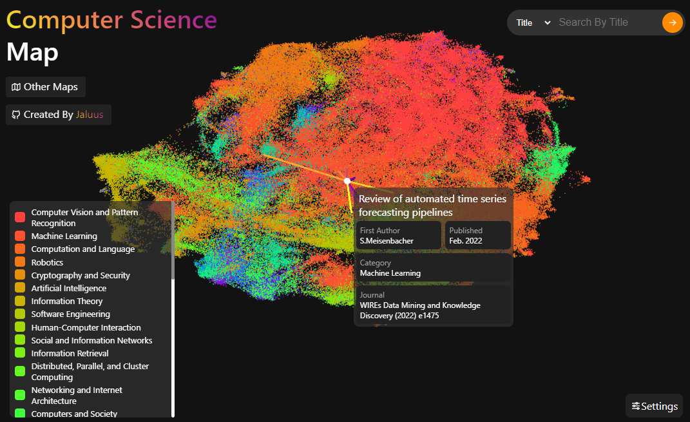

# ArXiv Atlas

This project visualizes the Arxiv Atlas, allowing users to explore research papers and their relationships visually.
It also allows for RAG recommendations based on user queries.

## Project Overview

The Arxiv Atlas is a web-based tool that provides an interactive map of research papers from the Arxiv repository.
Users can navigate through different categories, discover connections between papers, and get recommendations based on their interests.

## Features

- **Interactive Map**: Explore an interactive map of Arxiv papers creaed using LLM embeddings of the papers.
- **Search Functionality**: Search for specific papers or use semantic search to find relevant papers based on free text.
- **Visualization**: View relationships and connections between papers based purely on their content and resulting embeddings.

## How does the Recommendation System work?

The recommendation system relies on embeddings of the papers.
These embeddings are vector representations of the abstracts and titles, created using a [BERT-type language model](<https://en.wikipedia.org/wiki/BERT_(language_model)>).
While it's possible to use [GPT-type language models](https://en.wikipedia.org/wiki/Generative_pre-trained_transformer) for contextualized embeddings, they typically require more computational resources.

Embeddings capture the semantic meaning of the papers, enabling the calculation of similarity between papers based on their embeddings.
The similarity is measured using [cosine similarity](https://en.wikipedia.org/wiki/Cosine_similarity), which compares the angles between the vectors representing the papers.
A higher cosine similarity score indicates a greater semantic similarity between two papers.

I calculated the similarity between all[^1] papers in the dataset and stored the results in a similarity matrix.
When a user selects a paper, we use this similarity matrix to retrieve and recommend the most similar papers.

Additionally, the system can provide recommendations based on a semantic query, such as `"What are the challenges when using GAN-based classification methods?"`.
The query is embedded, and the system retrieves the most similar papers based on the closest match.
The search results are further improved by [reranking](https://www.pinecone.io/learn/series/rag/rerankers/) them using a reranking model.

## What model was used for the embeddings?

For internal testing, I used the [AnglE-optimized Text Embeddings](https://github.com/SeanLee97/AnglE)[^2] model with some fine-tuning to ArXiv embeddings.
A good library for fine-tuning is [Ragas](https://docs.ragas.io/en/stable/).

But for the ArXiv Atlas I'm using the [OpenAI `text-embedding-3-large` model](https://openai.com/index/new-embedding-models-and-api-updates/).
It has a good balance between performance and cost, and allows me not to run a GPU on my server 24/7 to serve requests.
Also, the model has the very nice property of being trained with [Matryoshka Representation Learning
](https://arxiv.org/abs/2205.13147)!
This means that the model compresses a lot of information into its first 256 dimensions[^3], giving me the ability to discard the rest of the dimensions, saving a lot of memory and thus being extremely performant.

## How does the visualization work?

Since the embedding vectors are typically 256 to 3072 dimensional and we are 3 dimensional beings, we need to somehow project the embeddings down to 2 or 3 dimensions to visualize them.
There are several different ways to do this, [Random Projections](https://en.wikipedia.org/wiki/Random_projection), [PCA](https://en.wikipedia.org/wiki/Principal_component_analysis), [t-SNE](https://en.wikipedia.org/wiki/T-distributed_stochastic_neighbor_embedding), [PaCMAP](https://github.com/YingfanWang/PaCMAP), etc....  
I'm using [UMAP](https://arxiv.org/abs/1802.03426) for this task because it's very performant, gives good results, and I'm a bit biased towards it.
I also use an autoencoder under the hood to compute the UMAP projections using a parametric approach. Its not in this repo as the code is messy, but I may publish it in the future.

If you are generally interested in how these methods work, there is a nice [paper](https://arxiv.org/abs/2012.04456) that explains a lot of them, but beware, its biased towards PaCMAP.

## Can I get the Data?

Sure, but I can't provide the similarity matrix because it's way too big.  
But I can provide a [script](backend\generate_similarity_list.py) to calculate the `N` closest papers to a given paper.

| Name                | Number of Papers | Size    | Last Updated  | Link                                                                    |
| ------------------- | ---------------- | ------- | ------------- | ----------------------------------------------------------------------- |
| Quantum Physics     | 68.548           | 59.3 MB | 21. July 2024 | [Download](https://1drv.ms/u/s!AgdSD7JL2c9JlZZ-bVQfSrkZ0KWXAA?e=IK7zQy) |
| High Energy Physics | 114.218          | 99.4 MB | 21. July 2024 | [Download](https://1drv.ms/u/s!AgdSD7JL2c9JlZZ9aarmOyOXDbGPPA?e=lVi68b) |
| Physics             | 134.741          | 126 MB  | 21. July 2024 | [Download](https://1drv.ms/u/s!AgdSD7JL2c9JlZZ_AcNdk8s7Lw5RvA?e=tdVQwZ) |
| Astro Physics       | 160.252          | 169 MB  | 21. July 2024 | [Download](https://1drv.ms/u/s!AgdSD7JL2c9JlZZYfY7gscjZvnPvBA?e=kmDFqA) |
| Condensed Matter    | 171.503          | 155 MB  | 21. July 2024 | [Download](https://1drv.ms/u/s!AgdSD7JL2c9JlZZZ8MG8cBkUGoQShw?e=O0FnKC) |
| Computer Science    | 485.772          | 452 MB  | 21. July 2024 | [Download](https://1drv.ms/u/s!AgdSD7JL2c9JlZZ8zTmjPUIwYftK6A?e=dCsUKy) |
| Combined            | 1.238.980        | 1.12 GB | 21. July 2024 | [Download](https://1drv.ms/u/s!AgdSD7JL2c9JlZZfFvzkRYw1Wq4FaA?e=cvjr6j) |

### Data Format

The data is stored in a [Pandas DataFrame](https://pandas.pydata.org/docs/index.html) and saved as a Pickle file.
The DataFrame has the following columns:

| Column Name        | Type                    | Description                                                                                   | Example                                            |
| ------------------ | ----------------------- | --------------------------------------------------------------------------------------------- | -------------------------------------------------- |
| title              | str                     | Title of the paper                                                                            | "GPT-4 Technical Report"                           |
| arxiv_id           | str                     | Arxiv ID of the paper                                                                         | "2303.08774"                                       |
| abstract           | str                     | Abstract of the paper                                                                         | "We report the development of GPT-4, a large-sc.." |
| main_category      | str                     | Main category of the paper                                                                    | "cs.CL"                                            |
| categories         | list                    | Categories of the paper                                                                       | ["cs.CL", "cs.AI"]                                 |
| revision           | str                     | Revision of the paper                                                                         | "6"                                                |
| published          | datetime                | Date of publication                                                                           | "2023-03-15 17:15:04"                              |
| updated            | datetime                | Date of last update                                                                           | "2024-03-04 06:01:33"                              |
| authors            | list                    | Authors of the paper                                                                          | ["OpenAI", "J. Achiam", "S. Adler", ...]           |
| journal_ref        | str                     | Journal reference                                                                             | "J. Mach. Learn. Res. 22 (2021) 1-21" or "\<NA\>"  |
| doi                | str                     | DOI of the paper                                                                              | "10.1234/5678" or "\<NA\>"                         |
| arxiv_comment      | str                     | Arxiv comment                                                                                 | "Submitted to ICLR 2023" or "\<NA\>"               |
| arxiv_DOI          | str                     | Arxiv DOI of the paper                                                                        | "10.1234/5678" or "\<NA\>"                         |
| abstract_embedding | np.ndarray (np.float16) | Embedding of the abstract (256 Dimensions) computed using the `text-embedding-3-large` model  | [-0.011314, -0.0605, -0.02097, -0.004242, ...]     |
| arxiv_year         | int32                   | The first part of the arxiv id, used for sorting                                              | 2303                                               |
| arxiv_number       | int32                   | The second part of the arxiv id, used for sorting                                             | 8774                                               |
| x_umap             | float32                 | UMAP projection of the embedding in the x dimension (Not available in the `Combined` dataset) | 0.1234                                             |
| y_umap             | float32                 | UMAP projection of the embedding in the y dimension (Not available in the `Combined` dataset) | 0.5678                                             |

## Getting Started

The project comprises a frontend and a backend component.

The frontend is built using [PixiJS](https://github.com/pixijs/pixijs) for rendering, [D3](https://github.com/d3/d3) for data manipulation and plain Javascript for the rest.
To learn more about the frontend, check out the [frontend README](frontend/readme.md).

The backend is built using Python and [FastAPI](https://github.com/fastapi/fastapi) for serving the data and handling search requests.
To learn more about the backend, check out the [backend README](backend/readme.md).

## License

This project is licensed under the MIT License. See the [LICENSE](LICENSE) file for more details.

## Acknowledgments

Special thanks to the Arxiv team for maintaining the repository and providing the data for this project.  
This project is not affiliated with Arxiv.org.

## Contact

This project is currently maintained by [Jan-Lucas Uslu](mailto:janlucas.uslu@gmail.com).  
Feel free to reach out to us for any questions or feedback.  
If you like the project, feel free to star it ⭐.

## Demo

Check out the live demo at [atlas.uslu.tech](https://atlas.uslu.tech).

[^1]: My full dataset contains about 1.2 million papers, meaning 600.000² dot products! My graphics card was fuming during the calculation of the similarity matrix.
[^2]:
    The AnglE-optimized Text Embeddings model is also based on BERT, and the [paper](https://arxiv.org/abs/2309.12871) is an interesting read for anyone interested in embeddings.
    You can also find it in the ArXiv Atlas. 🧠

[^3]: The anglE model produces 1024-dimensional embeddings, this means that the embeddings are about 4 times bigger than the OpenAI embeddings, so about 6GB of RAM are gone when serving the embeddings.
